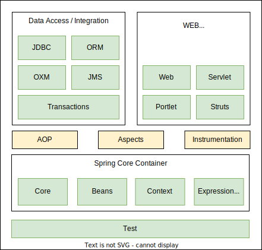

# A Comprehensive Guide to Spring 5 and Spring Boot 2

[[TOC]]

## 1. Introduction

### What is Spring?

Spring is a popular Java application framework that is used for building enterprise applications. The core features of the Spring Framework can be used in developing any Java application, but there are extensions for building web applications on top of the Java EE platform. Spring framework targets to make J2EE development easier to use and promotes good programming practices by enabling a POJO-based programming model.

The Spring framework is an open-source Java application framework, which is based on two key principles: **dependency injection** and **Inversion of Control**. Spring has the ability to autowire the dependency at run time, which allows the developer to write _loosely coupled_ code.


Spring framework uses metadata in the form of xml file or java annotations to create objects and identifies dependencies, thereby producing a ready-to-use application.

```java
// MovieRecommender class
public class MovieRecommender {
    ContentBasedFilter filter = new ContentBasedFilter();
    //...
}
```

Here is the `ContentBasedFilter class`:

```java
// ContentBasedFilter class
public class ContentBasedFilter {
  //...
}
```

Problems can arise when we want to use a different option for the dependency. Suppose we did not get good movie recommendations from the content-based filter and want to switch to a collaborative filter which takes into account the choices of users who have watched similar movies. This entails changing the code of `MovieRecommender`, which would be a disadvantage of using tightly coupled code.

### Tight Coupling

Tightly coupled code involves creating an instance of the dependency inside the class. As an example, suppose we have an application that recommends movies to watch. The application uses content-based filtering that employs item-to-item similarity as well as user preferences. The class `MovieRecommender` is directly instantiating an object of `ContentBasedFilter`, which makes `ContentBasedFilter` a dependency of `MovieRecommender`.

## Loose coupling[#](https://www.educative.io/module/page/JZmo10CA2Y09YLrPJ/10370001/5171942566133760/4937022602215424#Loose-coupling)

A better way would be to implement an interface. This will remove the direct instantiation of the `ContentBasedFilter`, and instead, ask for the type of filter as an argument to the constructor.

```java
interface Filter {    //method declarations}
```

Let’s look at the way to implement an interface:

```java
public class ContentBasedFilter implements Filter {    
  //implement interface methods
  }
```

Here’s the `MovieRecommender` class definition:

```java
public class public class MovieRecommender {
    Filter filter;

    public MovieRecommender(Filter filter) {
        this.filter = filter;
    }
    //...
} {
    Filter filter;

    public MovieRecommender(Filter filter) {
        this.filter = filter;
    }
    //...
}
```

### History

Spring was created by Rod Johnson in 2003. The first version was 1.0 released in March 2004. The Spring 2.0 was released in October 2006, Spring 3.0 in December 2009, Spring 4.0 in December 2013, Spring 4.3 in June 2016, Spring 5.0 in September 2017, and Spring 5.1 in September 2018.

### Terminologies

- **POJO**: Plain Old Java Object
- **IoC**: Inversion of Control
- **AOP**: Aspect-Oriented Programming
- **MVC**: Model-View-Controller
- **ORM**: Object-Relational Mapping
- **JDBC**: Java Database Connectivity
- **JPA**: Java Persistence API
- **JTA**: Java Transaction API
- **JMS**: Java Messaging Service
- **JMX**: Java Management Extensions
- **JCA**: Java Connector Architecture
- **JNDI**: Java Naming and Directory Interface

## Beans[#](https://www.educative.io/module/page/JZmo10CA2Y09YLrPJ/10370001/5171942566133760/5350377016000512#Beans)

Beans are the objects of classes that are managed by Spring. Traditionally, objects used to create their own dependencies, but Spring manages all the dependencies of an object and instantiates the object after injecting the required dependencies. The `@Component` annotation is the most common method of defining beans.

```java
@Component
public class Vehicle {
    //...
}
```

## Autowiring[#](https://www.educative.io/module/page/JZmo10CA2Y09YLrPJ/10370001/5171942566133760/5350377016000512#Autowiring)

The process of identifying a dependency, looking for a match, and then populating the dependency is called autowiring. The `@Autowired` annotation tells Spring to find and inject a collaborating bean into another. If more than one bean of the same type is available, Spring throws an error. In the following scenario, two beans of type `Operator` are detected by Spring:

```java
@Component
class Arithmetic(){
    @Autowired
    private Operator operator;
    //...
}

@Component
class Addition implements Operator {
   //...
}

@Component
class Subtraction implements Operator {
  //...
}
```

Spring will not know which bean to inject in the Arithmetic bean unless the developer explicitly specifies it.

## Dependency injection[#](https://www.educative.io/module/page/JZmo10CA2Y09YLrPJ/10370001/5171942566133760/5350377016000512#Dependency-injection)

Dependency injection is the process by which Spring looks up the beans that are needed for a particular bean to function and injects them as a dependency. Spring can perform dependency injection by using constructor or by using a setter method.

## Inversion of Control[#](https://www.educative.io/module/page/JZmo10CA2Y09YLrPJ/10370001/5171942566133760/5350377016000512#Inversion-of-Control)

Traditionally, the class which needed the dependency created an instance of the dependency. The class decided when to create the dependency and how to create it. For example, `Engine` class is a dependency of `Vehicle` class, which creates its object:

```java
public class Vehicle {
  private Engine engine = new Engine();
}
```

Spring takes this responsibility from the class and creates the object itself. The developer simply mentions the dependency and the framework takes care of the rest.

Thus, control moves from the component that needs the dependency to the framework. The framework takes the responsibility for finding out the dependencies of a component, ensuring their availability and injecting them in the component. This process is called Inversion of Control.


## IoC container[#](https://www.educative.io/module/page/JZmo10CA2Y09YLrPJ/10370001/5171942566133760/5350377016000512#IoC-container)

An IoC container is a framework that provides the Inversion of Control functionality.

The IoC container manages the beans. For the above mentioned example, it creates an instance of the `Engine` class, then creates an instance of `Vehicle` class, and then injects the `Engine` object as a dependency into the `Vehicle` object.

IoC container is a generic term. It is not framework specific. Spring offers two implementations of the IoC container:

1. Bean factory
2. Application context

```java
public class Vehicle {
  private Engine engine;
  public Vehicle(Engine engine) {
    this.engine = engine;
  }
}
```

## Spring Architecture

Spring is not one big framework. It is broken down into modules. This can be seen in the Maven Dependencies folder, where there are a lot of JAR files instead of just one big JAR.

Spring is built in a modular way and this enables some modules to be used without using the whole framework. It also makes integration with other frameworks easy. The developer can choose which module to use and discard ones that are not required.

## Spring Modules

The modules of Spring architecture, grouped together in layers, are shown below:



The Core Container contains the following modules: Beans, Core, Context, and Spring Expression Language (SpEL). These modules provide fundamental functionality of the Spring framework, like Inversion of Control (IoC), dependency injection, internationalization as well as support for querying the object at run time.

### Data access/ integration[#](https://www.educative.io/module/page/JZmo10CA2Y09YLrPJ/10370001/5171942566133760/6596527903735808#Data-access-integration)

Spring has very good integration with data and integration layers, and provides support to interact with databases. It contains modules like JDBC, ORM, OXM, JMS, and Transactions.

- The **JDBC** (Java Database Connectivity) module allows the data layer to interact with databases to get data or store data, or to interact with other systems without the need of cumbersome JDBC coding. Spring JDBC is very straightforward as compared to plain JDBC and makes the code very short.

- The **ORM** (Object Relational Mapping) module provides support to integrate with ORM frameworks including Hibernate and JPA.

- The **JMS** (Java Messaging Service) module talks to other applications through the queue to produce and consume messages.

- The **OXM** (object-XML mapping) module makes the object-to-XML transformation easy by providing useful features.

- The transaction management module provides support for successful rollback in case a transaction fails.


### Web (MVC/remoting)[#](https://www.educative.io/module/page/JZmo10CA2Y09YLrPJ/10370001/5171942566133760/6596527903735808#Web-MVCremoting)

It contains the Web, Servlets, Portlets, and Sockets modules to support the creation of a web application. Spring offers a web framework of its own called Spring MVC.

### Test[#](https://www.educative.io/module/page/JZmo10CA2Y09YLrPJ/10370001/5171942566133760/6596527903735808#Test)

The Test module handles the cross cutting concern of unit testing. The Spring Test framework supports testing with JUnit, TestNG, as well as creating mock objects for testing the code in isolation.

### AOP[#](https://www.educative.io/module/page/JZmo10CA2Y09YLrPJ/10370001/5171942566133760/6596527903735808#AOP)

The AOP module provides Aspect Oriented Programming functionality like method interception and pointcuts as well as security and logging features. Spring has its own module called Spring AOP that offers basic, aspect-oriented programming functionality. Advanced AOP functionality can be implemented through integration with AspectJ. AOP features cross cutting concerns from business logic.

## Spring projects[#](https://www.educative.io/module/page/JZmo10CA2Y09YLrPJ/10370001/5171942566133760/6596527903735808#Spring-projects)

Spring also provides solutions to different enterprise application problems through Spring projects. Some of them are discussed below:

**Spring Boot** is used to develop micro services. It makes developing applications easy through features like startup projects, auto configuration, and actuator. Spring Boot has gained massive popularity since it was first released in 201420142014.

**Spring Cloud** allows the development of cloud native applications that can be dynamically configured and deployed. It provides functionality for handling common patterns in distributed systems.

**Spring Data** provides consistent access to SQL and NoSQL databases.

**Spring Integration** implements the patterns outlined by the book _Enterprise Application Integration Patterns_. It allows enterprise applications to be connected easily through messaging and declarative adapters.

**Spring Batch** provides functionality to handle large volumes of data like ability to restart, ability to read from and write to different systems, chunk processing, parallel processing, and transaction management.

**Spring Security** provides security solutions for different applications be it a web application or a REST service. It also provides authentication and authorization features.

**Spring Session** manages session information and makes it easier to share session data between services in the cloud regardless of the platform/container. It also supports multiple sessions in a single browser instance.

**Spring Mobile** offers device detection and progressive rendering options that make mobile web application development easy.

**Spring Android** facilitates the development of Android applications.